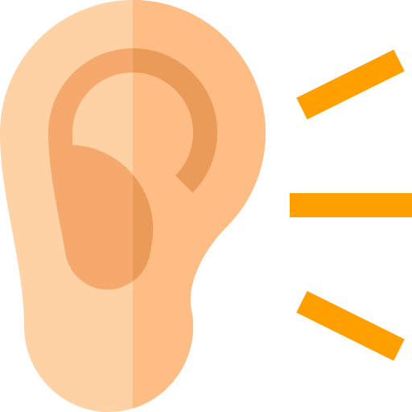

# tokenlogger-images
Image repository for TokenLogger applets

## Image Attribution
Here are the images used in TokenLogger applets, as well as the images used in the process of creating them. Images without source images to the left were created from scratch. 

| Applet Image                                                 | Image 1 | Image 2 | Image 3 | Image 4 |
|:------------------------------------------------------------:|:--------------:|:--------------:|:--------------:|:--------------:|
|  paid attention |  [source](https://www.flaticon.com/free-icon/ear_1005531?term=ear&related_id=1005531) |  [source](https://www.flaticon.com/free-icon/ear_1005531?term=ear&related_id=1005531)  |  |  |
|  cleaned room |  [source](https://www.flaticon.com/free-icon/visibility_802016?term=visibility&page=1&position=31&page=1&position=31&related_id=802016&origin=search) |  |  |  |
|  cleaned room |  [source](https://www.flaticon.com/free-icon/toothbrush_2554082?term=toothbrush&page=1&position=3&page=1&position=3&related_id=2554082&origin=search) |  |  |  |
